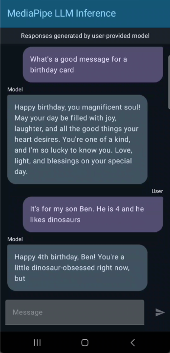

# MediaPipe LLM Inference Android Demo

### Overview

This is a sample app that demonstrates how to use the LLM Inference API to run common text-to-text generation tasks like information retrieval, email drafting, and document summarization.

This application must be run on a physical Android device to take advantage of the device GPU.



## How to Build the Demo App

### 1. Download the Code

To download the demo code, clone the git repository using the following command:

```
git clone https://github.com/google-ai-edge/mediapipe-samples
```

After downloading the demo code, you can import the project into Android Studio and run the app with the following instructions.

### 2. Prerequisites

*   The **[Android Studio](https://developer.android.com/studio)**
    IDE. This demo has been tested on Android Studio Hedgehog.

*   A physical Android device with a minimum OS version of SDK 24 (Android 7.0 -
    Nougat) with developer mode enabled.

### 3. Build and Run

To import and build the demo app:

1. Download [Android Studio](https://developer.android.com/studio) and install.

2. From the Android Studio, select **File > New > Import Project**.

3. Navigate to the demo app `android` directory and select that directory, for example: `.../mediapipe-samples/examples/llm_inference/android`

4. If Android Studio requests a Gradle Sync, choose **OK**.

5. Build the project by selecting **Build > Make Project**.

   When the build completes, the Android Studio displays a `BUILD SUCCESSFUL` message in the Build Output status panel.

To run the demo app:

1. Ensure that your Android device is connected to your computer and developer mode is enabled.

2. From Android Studio, run the app by selecting **Run > Run 'app'**.

## How to Use the Demo App

### 1. Select Model

The user first selects a model (e.g. `DEEPSEEK_CPU` for the DeepSeek model) from the model selection screen.

### 2. Download Model

If the model has not been downloaded previously, the app will download it from [LiteRT on Hugging Face](https://huggingface.co/litert-community).

If authentication and license acknowledgment are required to access the model, the user will be prompted to sign in with their Hugging Face account and acknowledge the license if necessary.

### 3. Chat with Model

Once the model is downloaded, the user can interact with it by entering prompts and receiving responses.

## Reference
For more details, see the [LLM Inference guide for Android](https://developers.google.com/mediapipe/solutions/genai/llm_inference/android).
